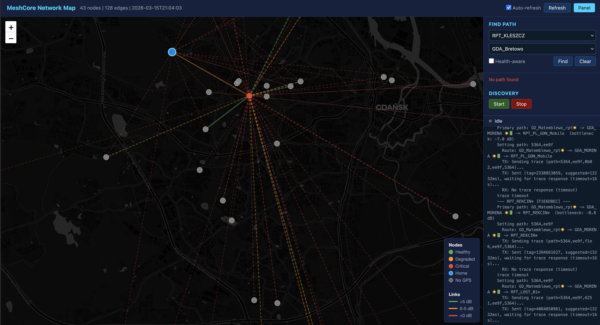

# MeshCore Network Topology Discovery & Path Optimizer

Automated mesh network topology discovery, visualization, and optimal path routing for [MeshCore](https://github.com/rocketscream/MeshCore) LoRa repeater networks.

Connects to your MeshCore companion radio, progressively discovers all reachable repeaters, maps their interconnections with bidirectional SNR measurements, and computes optimal routes using a widest-path (maximum bottleneck) algorithm.



## Features

**Topology Discovery**
- Progressive multi-round discovery starting from your companion repeater
- Trace sweep (no login needed) + neighbor table fetch (login with guest/admin passwords)
- Bidirectional SNR measurements for every link
- Automatic reverse edge inference for one-way links
- Resumable discovery -- interrupt anytime, continue later
- Alternative path probing through different intermediates

**Path Optimization**
- Widest-path algorithm (modified Dijkstra) finds routes with the best worst-link SNR
- Considers asymmetric links -- uses the weaker direction for realistic routing
- Alternative paths computed by excluding intermediates of better routes
- Health-aware routing -- penalizes congested or low-battery intermediates

**Node Health Monitoring**
- Collects repeater status during discovery (battery, TX queue, event overflows, flood duplicate rate, uptime)
- Computes health penalty scores that feed into path optimization
- Identifies problematic nodes (congestion, low battery, RF overload)

**Interactive Web Map**
- Real-time network visualization on OpenStreetMap (dark theme)
- Nodes color-coded by health, links colored by SNR quality
- Click any two nodes to compute and display optimal route with per-hop SNR
- Start/stop discovery from the browser -- live log streaming
- Auto-refresh every 10 seconds during discovery
- Nodes without GPS coordinates are estimated from neighbor positions
- Accessible from any device on your local network

**Text UI Manager**
- Menu-driven interface for discovery, path finding, topology editing, and configuration
- Network reports: topology overview, all-pairs bottleneck matrix, weak links, node health
- Manual data entry for traces and neighbor tables (from mobile app observations)
- Password and radio configuration management

## Requirements

- Python 3.7+
- A MeshCore companion radio accessible via TCP, serial, or BLE
- The [meshcore](https://pypi.org/project/meshcore/) Python library

## Installation

```bash
git clone https://github.com/stachuman/meshcore-optimizer.git
cd meshcore-optimizer
python3 -m venv .venv
source .venv/bin/activate
pip install -r requirements.txt
```

## Configuration

Copy the example config and edit for your setup:

```bash
cp config.example.json config.json
```

**config.json:**
```json
{
  "radio": {
    "protocol": "tcp",
    "host": "192.168.1.100",
    "port": 5000
  },
  "companion_prefix": "00000000",
  "discovery": {
    "max_rounds": 5,
    "timeout": 30.0,
    "delay": 5.0,
    "infer_penalty": 5.0,
    "save_file": "topology.json"
  },
  "passwords": [],
  "default_guest_passwords": ["", "hello"]
}
```

- **radio.protocol** -- `tcp`, `serial`, or `ble`
- **radio.host / port** -- for TCP connections (e.g., to a MeshCore device running a TCP server)
- **companion_prefix** -- first 8 hex chars of your companion repeater's public key
- **discovery.infer_penalty** -- SNR penalty (dB) applied when estimating reverse links

Optionally set up known passwords for repeaters:

```bash
cp passwords_example.json passwords.json
```

## Usage

### Web Map (recommended)

Start the interactive map server:

```bash
python web.py
```

Open the displayed URL (e.g., `http://192.168.1.20:8080`) in a browser on any device on your network. From there you can:

- Start/stop discovery using the panel controls
- Click two nodes to find the optimal path between them
- Toggle health-aware routing
- Watch nodes appear in real-time during discovery

Options:
```
--config, -C FILE    Config file (default: config.json)
--topology, -f FILE  Topology file (default: topology.json)
--port, -p PORT      HTTP port (default: 8080)
```

### Command-Line Discovery

Run discovery directly:

```bash
python -m meshcore_optimizer.discovery --config config.json
```

Options:
```
--config, -C FILE       Config file (default: config.json)
--topology FILE         Load existing topology to extend
--companion PREFIX      Override companion prefix
--max-rounds N          Max discovery rounds
--timeout SECS          Per-operation timeout
--plan                  Dry run -- show what would be discovered
--interactive, -i       Manual data entry mode (no radio needed)
```

### Path Computation

Compute optimal routes from an existing topology file:

```bash
# Best path between two nodes
python -m meshcore_optimizer.topology --topology topology.json --from-node MORENA --to-node SWIBNO

# All-pairs bottleneck matrix
python -m meshcore_optimizer.topology --topology topology.json --all-pairs

# With reverse edge inference
python -m meshcore_optimizer.topology --topology topology.json --all-pairs --infer 5.0
```

### Text UI Manager

Full-featured menu interface:

```bash
python tui.py
```

Provides discovery control, path finding, network reports, topology editing, and configuration management in a single interface.

## How It Works

Discovery runs in rounds, each with four phases of increasing cost:

1. **Trace sweep** -- trace all reachable nodes (no login needed, bidirectional SNR)
2. **Proximity probe** -- test close node pairs with no known link, improving routes early
3. **Login & neighbors** -- authenticate for full neighbor tables + node status (benefits from better routes)
4. **Flood discovery** -- firmware-based path discovery, reveals routes we missed

Routes are computed using a **widest-path algorithm** (modified Dijkstra) that maximizes the weakest link SNR, with configurable hop penalty, health-aware routing, and soft handling of inferred edges.

Discovery state is saved after every update. You can stop and resume anytime -- already-traced nodes are skipped.

For the complete technical description, see **[Discovery Process & Routing Algorithm](DISCOVERY.md)**.

## Project Structure

```
web.py                            Start the web map server
tui.py                            Start the text UI manager

meshcore_optimizer/               Core package
    constants.py                  Shared constants and defaults
    config.py                     Configuration, credentials, discovery state
    radio.py                      Radio communication helpers (connect, login, trace, status)
    topology.py                   Graph data structures, widest-path algorithm, serialization
    discovery.py                  Progressive multi-phase discovery engine
    interactive.py                Manual data entry REPL (no radio needed)
    web.py                        HTTP server, REST API, discovery/command control
    web_template.py               Embedded HTML/JS/CSS for the network map UI
    manager.py                    Text UI for network management

config.example.json               Example radio/discovery configuration
passwords_example.json            Example repeater credentials
```

You can also run modules directly with `python -m meshcore_optimizer.<module>`, or import:

```python
from meshcore_optimizer.topology import NetworkGraph, widest_path
from meshcore_optimizer.config import load_config
```

## License

MIT -- see [LICENSE](LICENSE).

## Author

Stan -- Gdansk MeshCore Network
